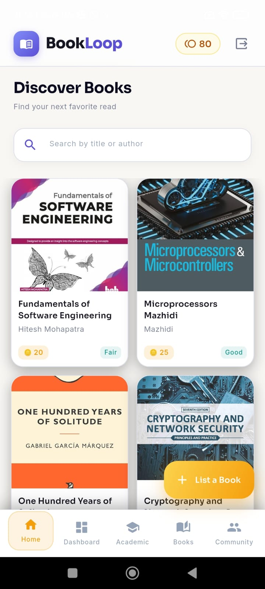
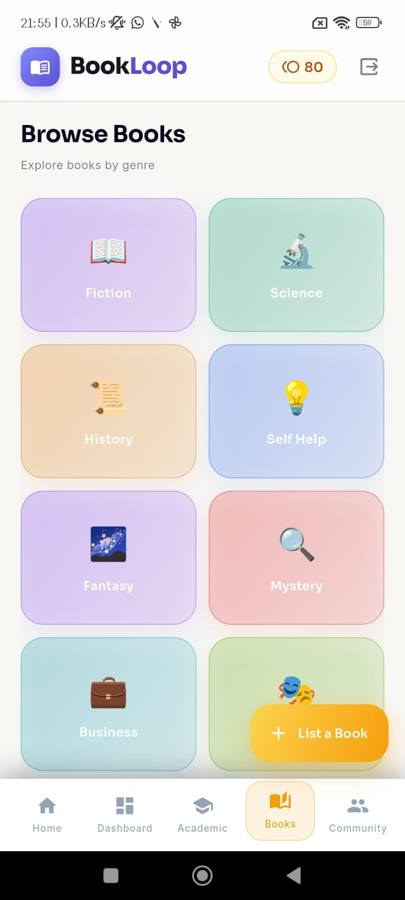
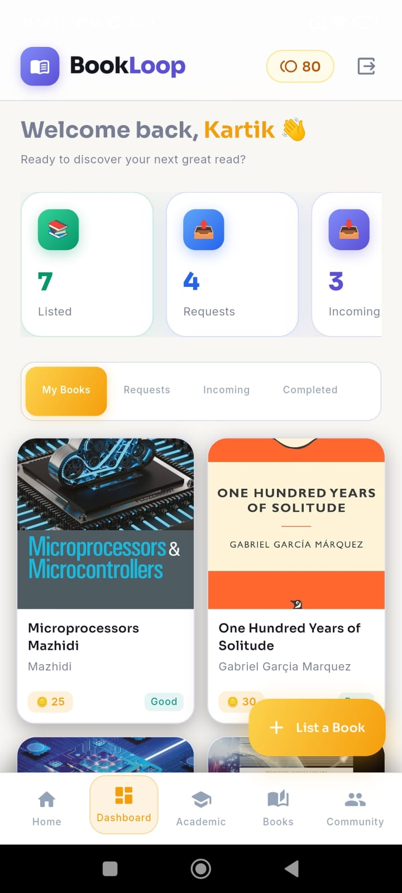
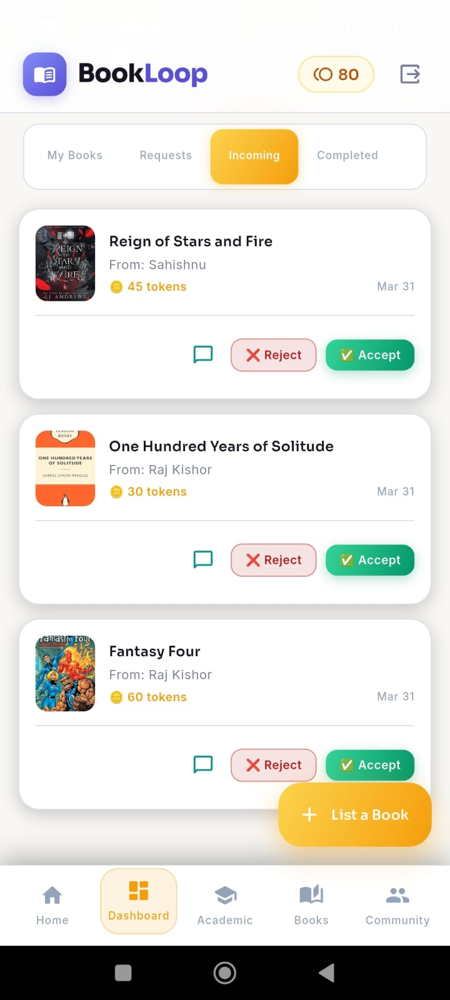
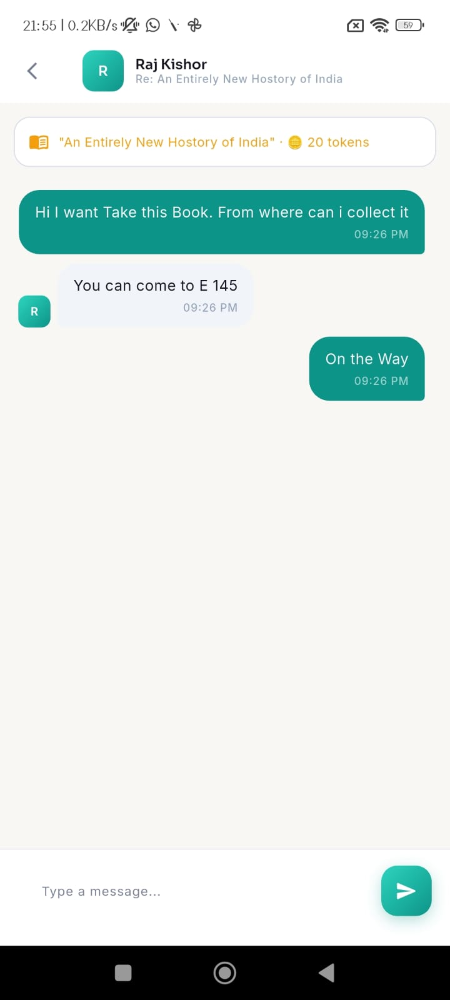
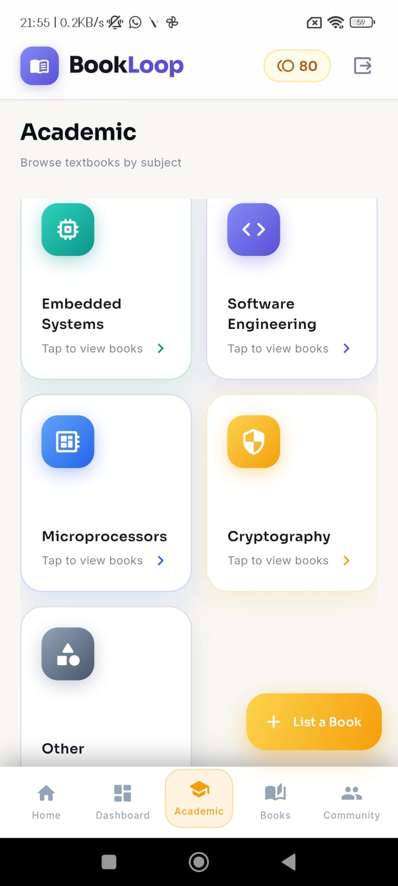
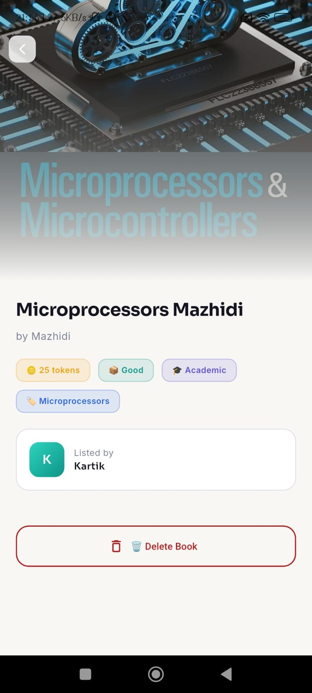

# 📚 BookLoop

A Flutter-based peer-to-peer book exchange app where users can share and exchange books using tokens instead of money.

---

## 🚀 Features

- 📖 Browse all books  
- 🔍 Search books by title or author  
- 🔄 Request & exchange books  
- 🪙 Token-based system  
- 📂 Categories (Academic, Fiction, Other)  
- ➕ Add your own books  
- 👥 Community chat  

---

## 🏠 Home Screen

- Shows all books by default  
- Includes search functionality  
- Clicking the BookLoop logo always returns to Home  

---

## 📱 Screenshots

<p align="center">
  
  
</p>

<p align="center">
  
  
</p>

<p align="center">
  
  
</p>

<p align="center">
  
  
</p>

<p align="center">
  
  
</p>

<p align="center">
  
  
</p>

<p align="center">
  
  
</p>

---

## 🛠️ Tech Stack

- Flutter  
- Dart  
- Firebase  
- Cloudinary  

---

## ⚙️ Run Locally

```bash
git clone https://github.com/namdev72/BookLoop.git
cd BookLoop
flutter pub get
flutter run
